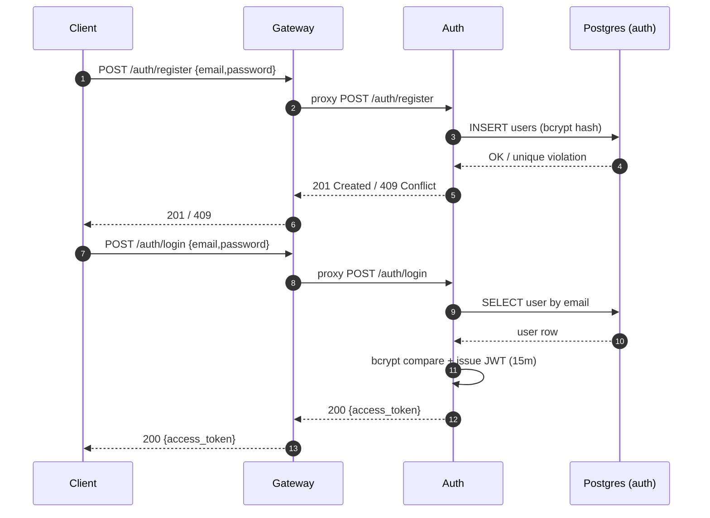
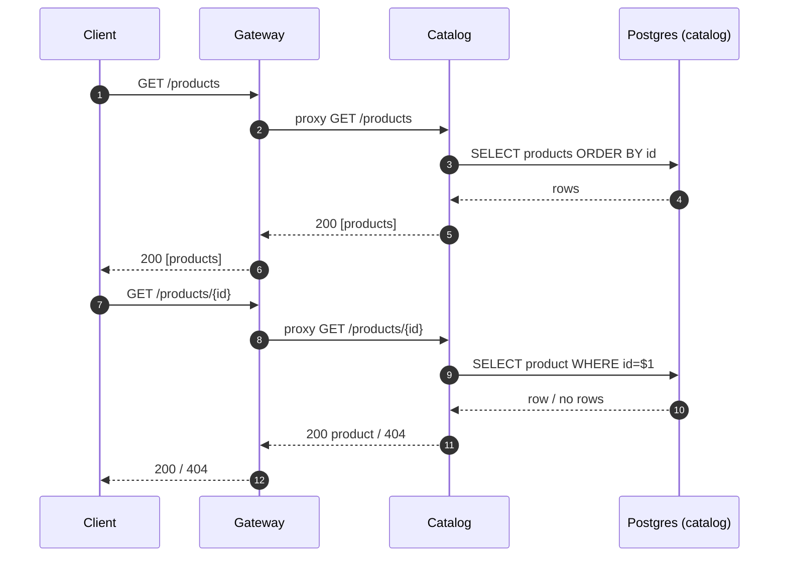
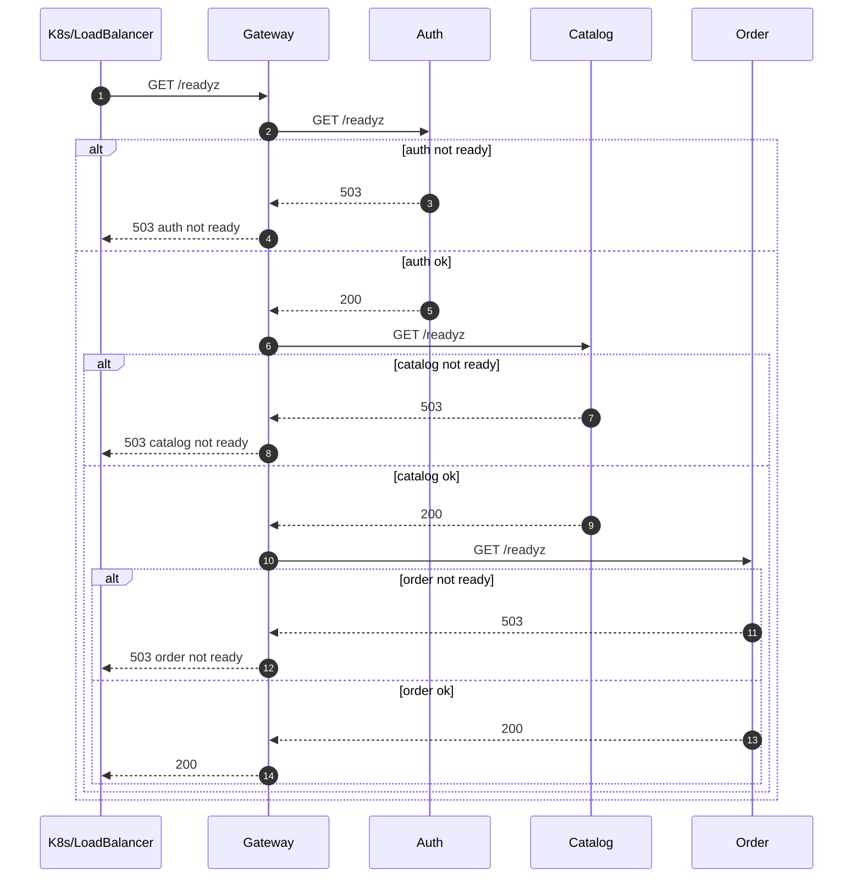

```mermaid
sequenceDiagram
  autonumber
  participant C as Client
  participant GW as Gateway
  participant O as Order
  participant CAT as Catalog
  participant DB as Postgres (order)

  C->>GW: POST /orders (Authorization: Bearer JWT) {items}
  GW->>GW: AuthJWT validate token (only for /orders/*)
  alt missing/invalid token
    GW-->>C: 401
  else token ok
    GW->>O: proxy POST /orders (Authorization header preserved)
    O->>O: AuthJWT validate token
    alt missing/invalid token
      O-->>GW: 401
      GW-->>C: 401
    else token ok
      loop for each item
        O->>CAT: GET /products/{product_id}
        alt 404
          CAT-->>O: 404
          O-->>GW: 400 invalid product_id
          GW-->>C: 400
        else non-200
          CAT-->>O: 5xx/4xx
          O-->>GW: 502 catalog error
          GW-->>C: 502
        else timeout/unavailable
          O-->>GW: 503 catalog unavailable
          GW-->>C: 503
        else 200
          CAT-->>O: 200 {price_cents,...}
          O->>O: accumulate total (overflow check)
        end
      end
      O->>DB: BEGIN; INSERT orders; INSERT order_items; COMMIT
      DB-->>O: OK
      O-->>GW: 201 {order}
      GW-->>C: 201 {order}
    end
  end
```

```mermaid
sequenceDiagram
  autonumber
  participant C as Client
  participant GW as Gateway
  participant O as Order
  participant DB as Postgres (order)

  C->>GW: GET /orders/{id} (Authorization: Bearer JWT)
  GW->>GW: AuthJWT validate token
  alt invalid token
    GW-->>C: 401
  else ok
    GW->>O: proxy GET /orders/{id}
    O->>O: AuthJWT validate token
    O->>DB: SELECT order; SELECT items
    DB-->>O: order + items / no rows
    alt not found
      O-->>GW: 404
      GW-->>C: 404
    else found
      O->>O: if order.user_id != token.user_id -> 403
      alt чужой заказ
        O-->>GW: 403
        GW-->>C: 403
      else свой заказ
        O-->>GW: 200 {order}
        GW-->>C: 200 {order}
      end
    end
  end
```

