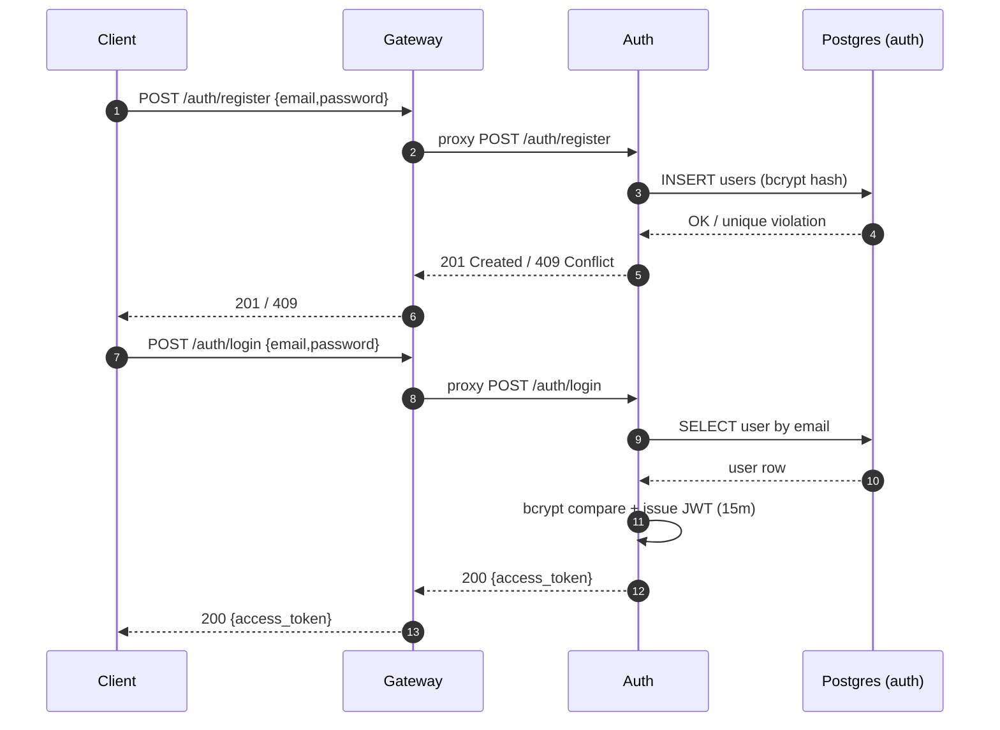

```mermaid
sequenceDiagram
    autonumber
    participant C as Client
    participant GW as Gateway
    participant A as Auth
    participant DB as Postgres (auth)
    
    C->>GW: POST /auth/register {email,password}
    GW->>A: proxy POST /auth/register
    A->>DB: INSERT users (bcrypt hash)
    DB-->>A: OK / unique violation
    A-->>GW: 201 Created / 409 Conflict
    GW-->>C: 201 / 409
    
    C->>GW: POST /auth/login {email,password}
    GW->>A: proxy POST /auth/login
    A->>DB: SELECT user by email
    DB-->>A: user row
    A->>A: bcrypt compare + issue JWT (15m)
    A-->>GW: 200 {access_token}
    GW-->>C: 200 {access_token}
```