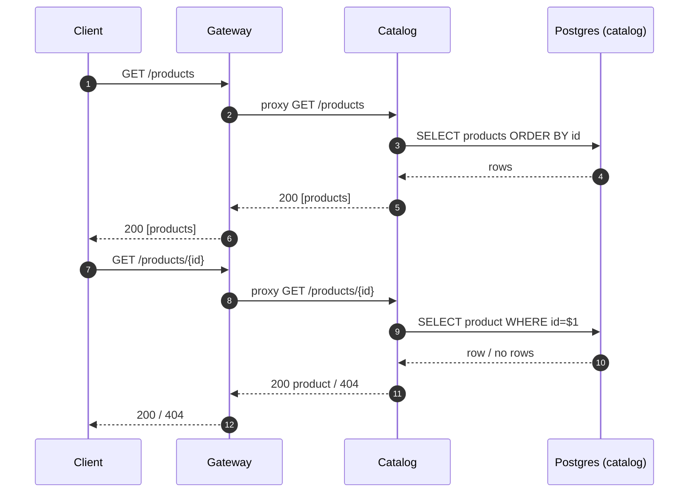

```mermaid
sequenceDiagram
    autonumber
    participant C as Client
    participant GW as Gateway
    participant CAT as Catalog
    participant DB as Postgres (catalog)
    
    C->>GW: GET /products
    GW->>CAT: proxy GET /products
    CAT->>DB: SELECT products ORDER BY id
    DB-->>CAT: rows
    CAT-->>GW: 200 [products]
    GW-->>C: 200 [products]
    
    C->>GW: GET /products/{id}
    GW->>CAT: proxy GET /products/{id}
    CAT->>DB: SELECT product WHERE id=$1
    DB-->>CAT: row / no rows
    CAT-->>GW: 200 product / 404
    GW-->>C: 200 / 404
```