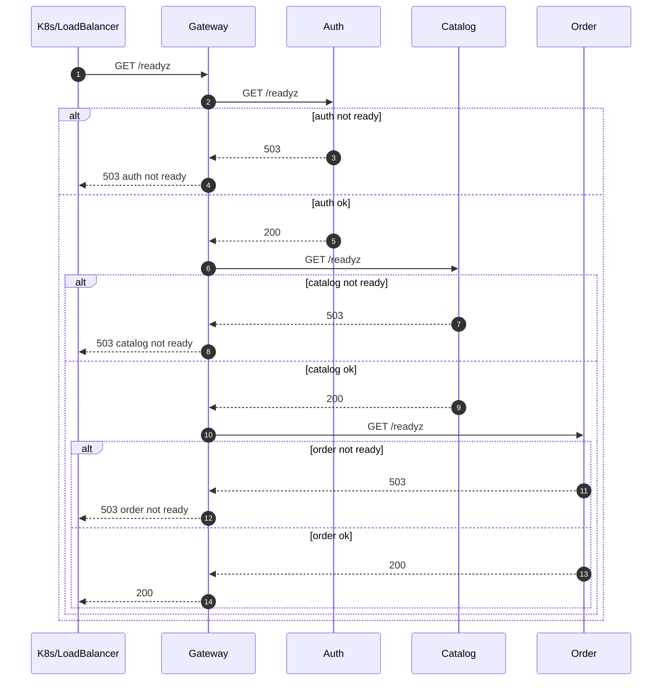

```mermaid
sequenceDiagram
  autonumber
  participant K as K8s/LoadBalancer
  participant GW as Gateway
  participant A as Auth
  participant C as Catalog
  participant O as Order

  K->>GW: GET /readyz
  GW->>A: GET /readyz
  alt auth not ready
    A-->>GW: 503
    GW-->>K: 503 auth not ready
  else auth ok
    A-->>GW: 200
    GW->>C: GET /readyz
    alt catalog not ready
      C-->>GW: 503
      GW-->>K: 503 catalog not ready
    else catalog ok
      C-->>GW: 200
      GW->>O: GET /readyz
      alt order not ready
        O-->>GW: 503
        GW-->>K: 503 order not ready
      else order ok
        O-->>GW: 200
        GW-->>K: 200
      end
    end
  end
```